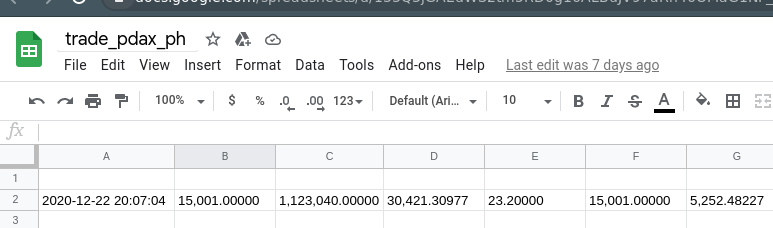

# trade_example

## This script gets data od currency from the site https://trade.pdax.ph/ and uploads it to the Google sheet document:

Example:


### How to run the script locally on the *nix like systems:

Setup virtual environment:
```
$ virtualenv .venv
```

Activate virtual environment:
```
$ ./venv/bin/activate
```

Install dependencies:
```
$ pip install -r requirements.txt
```

Run the script
```
$ python trade_padax.py
```
